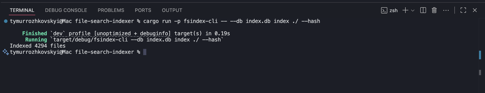
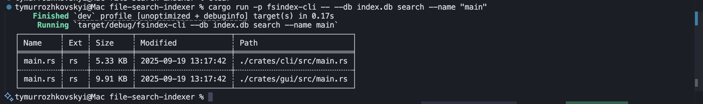
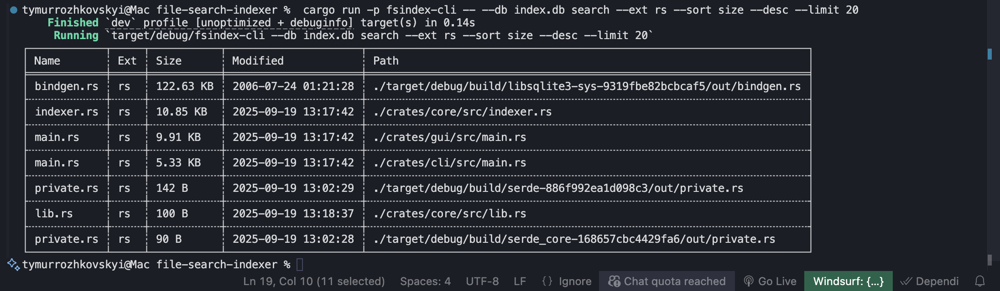
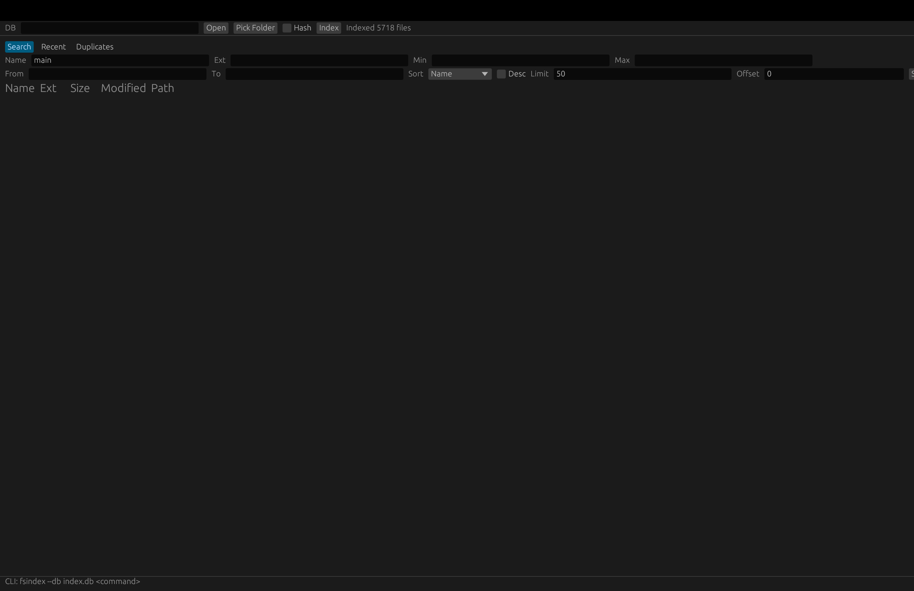

A local file indexing tool written in **Rust**.  
It recursively scans directories, stores file metadata in an index database (SQLite), and provides fast search by name, size, date, or extension.  
Both **CLI** (command-line interface) and **GUI** are available.

---

## Features
- **Recursive scanner** — indexes all files inside a given folder.  
- **Stores metadata**:  
  - path  
  - name  
  - extension  
  - size  
  - modified date  
  - added date  
  - optional hash (for duplicate detection)  
- **Search capabilities**:  
  - by name substring  
  - by extension  
  - by size (min/max)  
  - by modified date (from / to)  
- **Sorting** — by name, size, or date (ascending/descending).  
- **Pagination** — limit and offset support.  
- **Recently added** view — shows latest indexed files.  
- **Duplicate finder** — groups files with identical hashes and sizes.  
- **Error handling** — skips broken/unreadable files gracefully.  
- **Two interfaces**:  
  - CLI (terminal-based)  
  - GUI (based on egui / eframe).  

---

## Screenshots
- **Scanning folder**  
  

- **Search by name**  
  

- **Search by extension**  
  

- **GUI overview**  
  

---

## Installation & Setup

1. Clone the repository:
```bash
git clone https://github.com/yourname/file-search-indexer.git
cd file-search-indexer
```

2. Build the project (requires Rust):
```bash
cargo build --release
```

3. Binaries will be located in:
- `target/release/fsindex-cli`  
- `target/release/fsindex-gui`  

---

## Usage

### CLI Examples
Index a folder (with hash calculation for duplicates):
```bash
cargo run -p fsindex-cli -- --db index.db index --path ./Documents --hash
```

Search by name:
```bash
cargo run -p fsindex-cli -- --db index.db search --name "report"
```

Search by extension:
```bash
cargo run -p fsindex-cli -- --db index.db search --ext pdf --sort size --desc --limit 20
```

Search by size/date:
```bash
cargo run -p fsindex-cli -- --db index.db search --min-size 1000000 --from 2024-01-01
```

Show recently added files:
```bash
cargo run -p fsindex-cli -- --db index.db recent --limit 50
```

Find duplicate files:
```bash
cargo run -p fsindex-cli -- --db index.db duplicates --limit 25
```

---

### GUI
Run:
```bash
cargo run -p fsindex-gui
```

In the window:
- Select or create `index.db`  
- Pick a folder and press **Index**  
- Use tabs:  
  - **Search** — filter files  
  - **Recent** — show last indexed files  
  - **Duplicates** — find duplicates  
